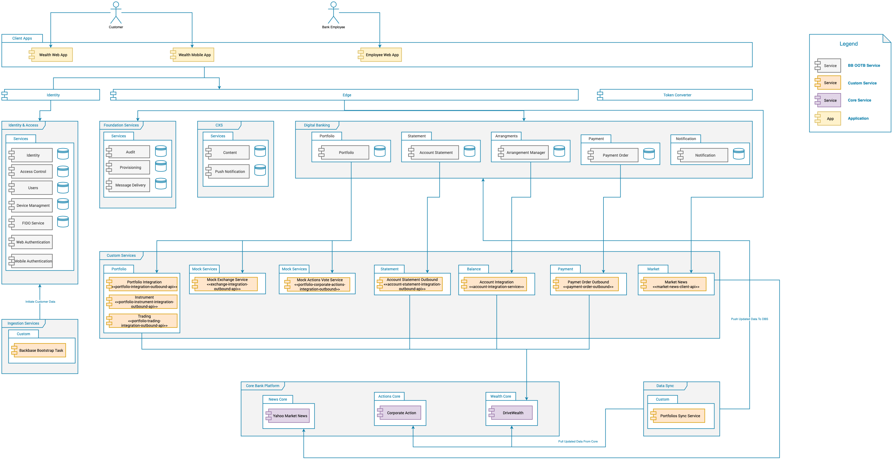

# Accelerator Project Wealth

This project provide accelerator for wealth integration services using

* Yahoo Finance as Market News provider
* Drive-wealth integration as wealth provider

## Market News Integration Services

* [market-news-clients README.md](./market-news-clients/README.md)
* [market-news-service README.md](./market-news-service/README.md)

## Wealth Integration Services
  
* [drive-news-clients README.md](./drive-wealth-clients/README.md)
* [portfolio-instrument-integration-service README.md](./portfolio-instrument-integration-service/README.md)
* [portfolio-outbound-integration README.md](./portfolio-outbound-integration/README.md)
* [portfolio-trading-integration-service README.md](./portfolio-trading-integration-service/README.md)
* [wealth-data-sync-service README.md](./wealth-data-sync-service/README.md)

## Documentation

The following documentation is an export from the project confluence docs, that contains the Architecture Diagram, API mapping, and Entitlement setup.

### High Level Architecture

### Data Ingestion

* [drive-wealth-integration-entitlements](docs/drive-wealth-integration-entitlements/drive-wealth-integration-entitlements.md)
* [model-ingest-product-catalog-accounts-json-in-bootstrap](docs/model-ingest-product-catalog-accounts-json-in-bootstrap/model-ingest-product-catalog-accounts-json-in-bootstrap.md)
* [model-ingest-static-data-json-in-bootstrap](docs/model-ingest-static-data-json-in-bootstrap/model-ingest-static-data-json-in-bootstrap.md)
* [model-ingest-user-portfolio-from-dw-into-dbs](docs/model-ingest-user-portfolio-from-dw-into-dbs/model-ingest-user-portfolio-from-dw-into-dbs.md)

### Outbound Integration

* [portfolio-outbound-integration-api-mapping](docs/portfolio-outbound-integration-api-mapping/portfolio-outbound-integration-api-mapping.md)
* [portfolio-trading-outbound-api-mapping](docs/portfolio-trading-outbound-api-mapping/portfolio-trading-outbound-api-mapping.md)
* [instrument-integration-outbound-api-mapping](docs/instrument-integration-outbound-api-mapping/instrument-integration-outbound-api-mapping.md)
* [market-news-client-api-mapping](docs/market-news-client-api-mapping/market-news-client-api-mapping.md)

### Data Synchronization

* [bulk-funding-settlement](docs/bulk-funding-settlement/bulk-funding-settlement.md)
* [modelbank-wealth-github-topics-topstack-selectors](docs/modelbank-wealth-github-topics-topstack-selectors/modelbank-wealth-github-topics-topstack-selectors.md)
* [order-status-update](docs/order-status-update/order-status-update.md)
* [update-instrument-holdings](docs/update-instrument-holdings/update-instrument-holdings.md)
* [update-portfolio-allocation](docs/update-portfolio-allocation/update-portfolio-allocation.md)
* [update-portfolio-list-performance](docs/update-portfolio-list-performance/update-portfolio-list-performance.md)
* [update-portfolio-positions](docs/update-portfolio-positions/update-portfolio-positions.md)
* [update-portfolio-transactions](docs/update-portfolio-transactions/update-portfolio-transactions.md)