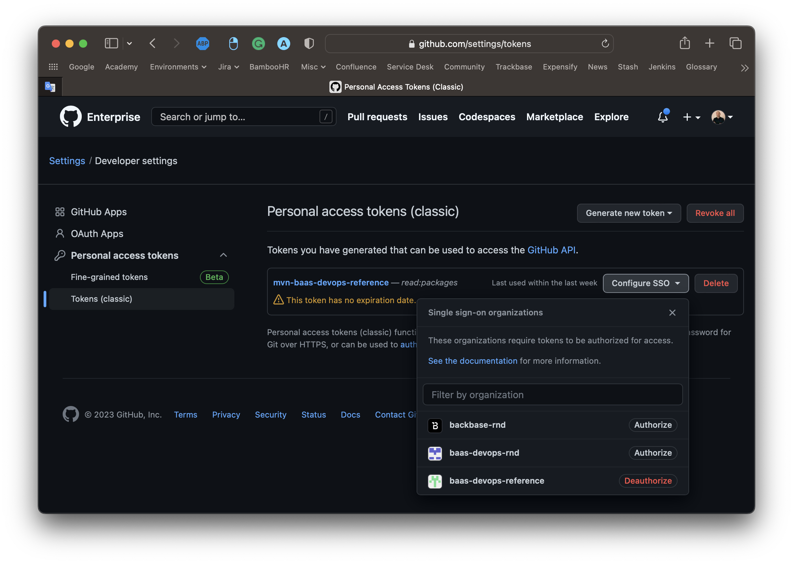
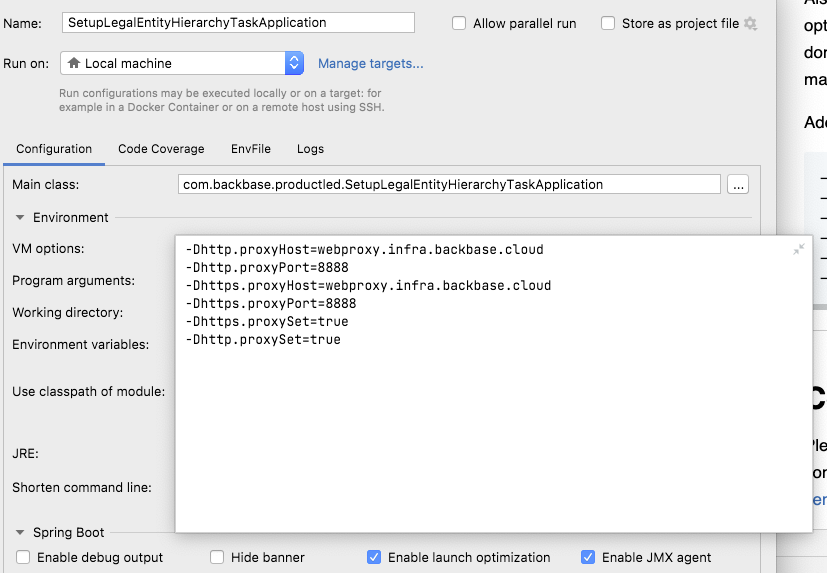
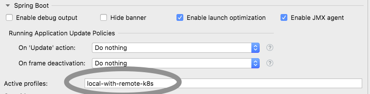

# Backbase Bootstrap Task

## Repository overview

- This project implements cloud-native intuitive, microservices design patterns, and coding best practices.
- The `backbase-bootstrap-task` relies on [Stream](https://github.com/Backbase/stream-services-2.0) to perform data ingestion and validation.
- It is **expected to be run as a job**: performing the expected tasks and exiting upon completion. Task execution is (or tries to be) **idempotent**,
  as data is upserted.
- It can be configured to create resources in Mambu (optional), Marqeta (optional), DBS and Identity (optional).
- Ingested data comes from files such as `src/main/resources/le-hierarchy/le-base-structure.json` and `src/main/resources/product-catalog/product-catalog.json`.
- The project follows [**CloudNative**](https://www.cncf.io/) recommendations and the [**twelve-factor app**](https://12factor.net/) methodology for building *software-as-a-service apps* to show how μServices should be developed and deployed. 
- This project uses technologies broadly used in Backbase.Like Docker, Kubernetes, Java SE 11, Spring Boot, Spring Cloud
- Refer to [workflow guide](../../../docs/tree/master/backend) for the Backend CI Workflow documentation. Though this project only uses `develop-version-update.yml`, `master-initial-commit.yml` and `pull-request-check.yml` as it's not intended to be used as a production-ready artifact.

## Resources overview
A successful run of this job will create the following Backbase resources:
- Product Catalog (Product Types and Kinds)
- Root Legal Entity and its user(s)
- Reference Job Roles (Function Group Templates)
- Custom Job Roles (Function Group Templates)
- Children Legal Entities and Users
- User Profiles (optional)
- Product Arrangements
- Function Groups, Data Groups and User Permissions
- Contacts
- Limits
- Approval
- Admin APS
- Content Services templates for Transaction Signing
- Firebase Push Integration Certificate
- Portfolio (optional)
- Portfolio Allocation (optional)
- Aggregated Portfolio (optional)
- Positions (optional)
- Positions Hierarchy (optional)
- Position Transactions (optional)
- Wealth Regions (optional)
- Wealth Asset Classes (optional)
- Wealth Transaction categories (optional)
### Identity (optional)
- Users
- Email verify
- Password setup
- Admin roles
### Drive Wealth (optional)
- Users
- Investment Account
- Initial Deposit
- Orders
- Positions
- Transactions
### Mambu (optional)
- Users (Mambu Clients)
- Arrangements (funded)
- Random transactions
### Marqeta (optional)
- Users
- Card Product
- Card Product Velocity
- Card
### Payveris Mock (optional)
- User creation

## Local development

To be able to build locally, please add this to your local Maven settings in `~/.m2/settings.xml`:
```xml
<repository>
    <id>github-baas-ref</id>
    <url>https://maven.pkg.github.com/baas-devops-reference/*</url>
    <snapshots>
        <enabled>true</enabled>
    </snapshots>
</repository>
```

And generate a GitHub token and add it here.

### How to generate a GitHub token and add that to Maven configuration

- Visit the following page (logged in with your EMU user - username ends with `_backbase`) https://github.com/settings/tokens
- Click on `Generate new token`
- You can name it `mvn-baas-devops-reference` (or whatever makes sense for you)
— Provide the following permission: `read:packages` (no other permission is needed)
- Authorize the token by clicking on the `Configure SSO` button next to the created token name and `Authorize` the `baas-devops-reference` organization



Add the generated GitHub token to the Maven settings in `~/.m2/settings.xml`:

```xml
        <server>
            <id>github-baas-ref</id>
            <username>[USERNAME]_backbase</username>
            <password>[GITHUB TOKEN]</password>
        </server>
```

## Repository description

### Project structure

<details>
  <summary>Click to expand</summary>

The project structure for each custom integration service follows the pattern as described below:

```
.
├── .github                       # All GitHub Actions files
│   ├── ISSUE_TEMPLATE            # Templates for 'major','minor','patch' releases
│   └── workflows                 # GitHub Actions workflows for CI
├── src                           # Source and Unit Test files
    ├── main                      # Application container projects
    │   ├── java/com/backbase/productled
    │   │   ├── api               # Controller classes
    │   │   │   └── ...
    │   │   ├── config            # Configuration classes
    │   │   │   └── ...
    │   │   ├── mapper            # Model classes
    │   │   │   └── ...
    │   │   └── service           # Service classes
    │   │       └── ...
    │   └── resources             # All resource files except core classes
    │       └── ...
    └── test                      # JUnit test files
        └── ...
```

To view individual classes for this repository, select relevant branch from the GitHub UI and then press '.'  This will open the GitHub Web Editor. 
Alternatively, you can also access the Web Editor by changing `.com` to `.dev` in the URL. 

Expand each file in the Web Editor for explanation and purpose.
</details>

### Notable files
<details>
  <summary>Click to expand</summary>

- `src/main/resources/product-catalog/product-catalog.json` - the definition of products catalog. It describes what what kind of banking products the bootstrap task is going to create and with what properties. The reference for that JSON can be obtained at [Product Catalog OpenAPI specification](https://github.com/Backbase/stream-services-2.0/blob/master/api/stream-product-catalog/openapi.yaml). The product catalog bootstrapping will be performed **before** bootstrapping the legal entities hierarchy.
- `src/main/resources/le-hierarchy/le-base-structure.json` - the definition of the base hierarchy starting with root legal entity object. It describes the base legal entity structure the bootstrap task is going to create and with what properties. The reference for that JSON can be obtained at [Legal Entity OpenAPI specification](https://github.com/Backbase/stream-services-2.0/blob/master/api/stream-legal-entity/openapi.yaml). The legal entities bootstrapping will be performed **after** bootstrapping the product catalog.
</details>

### Project dependencies
<details>
  <summary>Click to expand</summary>

Dependencies:
```
- Mambu clients
- Marqeta clients
- Drive Wealth clients
- Identity clients
- Payveris Mock clients
```
</details>

## Configuration

### Backbase Bootstrap Task configuration
<details>
  <summary>Click to expand</summary>

As stated above, some components are optional and can be enabled or disabled with following config properties:

| Property                                                     | Default | Description                                                           |
|--------------------------------------------------------------|---------|-----------------------------------------------------------------------|
| `mambu.bootstrapResourcesEnabled`                            | false   | Enable resources creation in Mambu                                    |
| `marqeta.bootstrapResourcesEnabled`                          | false   | Enable resources creation in Marqeta                                  |
| `drive-wealth.bootstrapResourcesEnabled`                     | false   | Enable resources creation in Drive Wealth                             |
| `admin.bootstrapManualStepsEnabled`                          | false   | Enable manual steps in Identity console                               |
| `payveris.bootstrapPayverisMockEnabled`                      | false   | Enable user creation on payveris in-memory db                         |
| `backbase.stream.legalentity.sink.useIdentityIntegration`    | true    | Enable user creation in Identity using integration service            |
| `backbase.stream.legalentity.sink.userProfileEnabled`        | false   | Enable User Profile creation in DBS (requires `user-profile-manager`) |
| `backbase.stream.audiences.segmentation.user-kind.enabled`   | false   | Enable UserKind Segmentation(requires `user-segments-collector`)      |
| `enableExperimentalUniversalSupport`                         | false   | Enable the experimental support for Universal+ (EUR currency)         |

### Mambu configuration
The following properties **must** be set as they have no default:

| Property                                  | Description                                                           |
|-------------------------------------------|-----------------------------------------------------------------------|
| `mambu.baseUrl`                           | Base URL of Mambu API (i.e. `https://backbase.sandbox.mambu.com/api`) |
| `mambu.username`                          | API username                                                          |
| `mambu.password`                          | API password                                                          |
| `mambu.branchKey`                         | Branch ID where resources will be created                             |
| `mambu.currentAccountProductKey`          | Product ID linked to Current Accounts                                 |
| `mambu.savingsAccountProductKey`          | Product ID linked to Savings Accounts                                 |
| `mambu.creditCardAccountProductKey`       | Product ID linked to Credit Cards                                     |
| `mambu.transactionsBeneficiaryAccountKey` | Account used as beneficiary for the random transactions               |

### Marqeta client configuration
The following properties **must** be set as they have no default:

| Property                                  | Description                                                         |
|-------------------------------------------|---------------------------------------------------------------------|
| `marqeta.baseUrl`                         | Base URL of Marqeta API (i.e. `https://sandbox-api.marqeta.com/v3`) |
| `marqeta.username`                        | API username                                                        |
| `marqeta.password`                        | API password                                                        |
| `marqeta.debugEnabled`                    | Enable to print request/response of every marqeta api call          |
| `marqeta.card.name`                       | Card Name                                                           |
| `marqeta.card.currencyCode`               | Currency code for the card velocity                                 |
| `marqeta.card.usageLimit`                 | Represent how many times card can be used in a day                  |
| `marqeta.card.amountLimit`                | Represent how much amount can be used on a card                     |
| `marqeta.card.metaData.atmMaxAmount`      | ATM withdrawal max limit                                            |
| `marqeta.card.metaData.atmMinAmount`      | ATM withdrawal min limit                                            |
| `marqeta.card.metaData.onlineMaxAmount`   | Online cad usage max limit                                          |
| `marqeta.card.metaData.onlineMinAmount`   | Online cad usage min limit                                          |
| `marqeta.card.metaData.type`              | Represent type of card either Debit or Credit                       |
| `marqeta.card.metaData.subType`           | Represent subtype of card either ATM or ONLINE                      |
| `marqeta.card.metaData.brand`             | Vendor of a card either visa or mastercard                          |
| `marqeta.card.metaData.currency`          | Currency code of a card                                             |
| `marqeta.card.metaData.replacementStatus` | Replacement status of card                                          |

### Drive Wealth configuration
The following properties **must** be set as they have no default:

| Property                                   | Description                                                                                     |
|--------------------------------------------|-------------------------------------------------------------------------------------------------|
| `drive-wealth.baseUrl`                     | Base URL of Drive Wealth API                                                                    |
| `drive-wealth.dwClientAppKey`              | `dw-client-app-key` header for all requests as integrator's unique identifier for rate limiting |
| `drive-wealth.clientID`                    | The identifier of the client accessing the DriveWealth system.                                  |
| `drive-wealth.clientSecret`                | The secret of the client accessing the DriveWealth system.                                      |

</details>

### Admin (Backbase Identity/Keycloak) client configuration

<details>
  <summary>Click to expand</summary>

The following properties **must** be set as they have no default:

| Property                    | Description                  |
|-----------------------------|------------------------------|
| `admin.baseUrl`             | Base URL of Identity console |
| `admin.username`            | API username                 |
| `admin.password`            | API password                 |
| `admin.defaultUserPassword` | Default password for users   |

</details>

### Payveris Mock client configuration
<details>
  <summary>Click to expand</summary>

The following properties **must** be set as they have no default:

| Property                   | Description                       |
|----------------------------|-----------------------------------|
| `payveris.payverisBaseUrl` | Base URL of payveris-mock service |

</details>

### Stream configuration
<details>
  <summary>Click to expand</summary>

Configuration properties used by Stream to interact with Backbase services (DBS, Token converter...).
Default values:
```yaml
spring:
  security:
    oauth2:
      client:
        registration:
          bb:
            authorization-grant-type: client_credentials
            client-id: bb-client
            client-secret: bb-secret
            client-authentication-method: post
        provider:
          bb:
            token-uri: http://token-converter:8080/oauth/token
backbase:
  stream:
    legalentity:
      sink:
        useIdentityIntegration: true
        userProfileEnabled: true
    dbs:
      user-manager-base-url: http://user-manager:8080
      access-control-base-url: http://access-control:8080
      arrangement-manager-base-url: http://arrangement-manager:8080
      limits-manager-base-url:  http://limits-manager:8080
      contact-manager-base-url: http://contact-manager:8080
      approvals-base-url: http://approval-service:8080
    identity:
      identityIntegrationBaseUrl: http://identity-integration-service:8080

payveris:
  payverisBaseUrl: http://payveris-mock:8080
```
</details>

### Runtime configuration
<details>
  <summary>Click to expand</summary>

| Property                   | Description       |
|----------------------------|-------------------|
| `environment.installation` | Installation Name |
| `environment.runtime`      | Runtime name      |

</details>

## Customisation in project

### Configuration changes

<details>
  <summary>Click to expand</summary>

If the integration is done with Mambu and Marqeta as core banking systems then change the following properties

- `mambu.username`
- `mambu.password`
- `mambu.baseUrl`
- `marqeta.baseUrl`
- `marqeta.username`
- `marqeta.password`

To point to a different Mambu branch, current/saving ProductKey and transactionsBeneficiary AccountKey, change the following properties

- `branchKey`
- `currentAccountProductKey`
- `savingsAccountProductKey`
- `transactionsBeneficiaryAccountKey`

If not integrated with Mambu or Marqeta as core banking systems then the above configuration will not come into picture as the current implementation only support these two external systems.

If the integration is done with Drive Wealth as core banking systems for Wealth management then change the following properties

- `drive-wealth.baseUrl`
- `drive-wealth.dwClientAppKey`
- `drive-wealth.clientID`
- `drive-wealth.clientSecret`

If not integrated with Drive Wealth as core banking systems then the above configuration will not come into picture as the current implementation only support these two external systems.

</details>

### Component changes

<details>
  <summary>Click to expand</summary>

- `MambuService`: Replace this with your corresponding core banking functionality to create and retrieve data.
- `MarqetaService`: Replace this with your corresponding core banking's card system functionality to create and retrieve data.
- `DriveWealthService`: Replace this with your corresponding wealth core banking's card system functionality to create and retrieve data.
- `MambuRestClientConfiguration`, `MambuConfigurationProperties` and `DriveWealthRestClientConfiguration` : core banking configuration
- `MarqetaRestClientConfiguration`, `MarqetaConfigurationProperties` and `DriveWealthConfigurationProperties`: core banking's card system configuration

</details>

## Getting Started
### BaaS setup
<details>
  <summary>Click to expand</summary>

- [ ] Step 1: (AWS) Modify https://github.com/baas-devops-reference/ref-self-service/blob/main/self-service.tfvars by adding to `ecr` list name of new repository: `backbase-bootstrap-task`
- [ ] Step 2: Make sure the desidered configuration (via TopStack values or basic-configuration.yaml) is supplied
- [ ] Step 3: Run the pre-commit to validate the configurations => `pre-commit run --all-files --show-diff-on-failure --color=always`
- [ ] Step 4: Commit and Push your changes; wait for the template rendering and lint jobs to complete
- [ ] Step 5: Merge into `main` to trigger deployment.
</details>

### Local setup
<details>
  <summary>Click to expand</summary>

- [ ] Step 1: Ensure to check the prerequisites for [local developer environment](https://community.backbase.com/documentation/ServiceSDK/latest/create_developer_environment)
- [ ] Step 2: Create `src/main/resources/application-local.yaml` file, then add and modify:
```yaml
  mambu:
    baseUrl: https://projectmoustache.sandbox.mambu.com/api
    username: <YOUR_MAMBU_USERNAME>
    password: <YOUR_MAMBU_PASSWORD>
    branchId: product-led
  marqeta:
    baseUrl: https://sandbox-api.marqeta.com/v3
    username: <YOUR_MAQETA_USERNAME>
    password: <YOUR_MAQETA_PASSWORD>
  drive-wealth:
    baseUrl: https://bo-api.drivewealth.io
    dwClientAppKey: <YOUR_SANDBOX_APP_KEY>
    clientID: <YOUR_SANDBOX_CLIENT_ID>
    clientSecret: <YOUR_SANDBOX_CLIENT_SECRET>
  admin:
    baseUrl: https://identity.dev.ref.live.backbaseservices.com/auth
    username: <IDENTITY_ADMIN_USERNAME>
    password: <IDENTITY_ADMIN_PASSWORD>
    defaultUserPassword: <DEFAULT_USER_PASSWORD> # Pass1234
  payveris:
    payverisBaseUrl: http://localhost:{port-forwarded} # Check application-local-with-remote-k8s.yml file
```
- [ ] Step 3: Make sure all the services needed by the bootstrap task are available. You can:
  - run them locally,
  - use [Telepresence](https://www.telepresence.io/),
  - manually provide port forwards to your Kubernetes cluster. The list of services needed can be found in `src/main/resources/application-local-with-remote-k8s.yml`. You can use the same file as Spring Boot configuration (`-Dspring.profiles.active=local,local-with-remote-k8s`) in the next step. The port forwards can be created using the following K8s command:

    ```kubectl -n backbase port-forward $(kubectl -n backbase get pods| grep 'token-converter' -m1 | cut -d' ' -f1) 18080:8080 ```

    where you obviously need to replace the `token-converter` with any service you want to port forward to, and `18080` with your desired local TCP port (they have to be unique on your machine). 
- [ ] Step 4: Run command => `mvn spring-boot:run -Dspring.profiles.active=local`
- [ ] Step 5: To run the service from the built binaries, use => `java -jar target/backbase-bootstrap-task-x.y.z-SNAPSHOT.jar -Dspring.profiles.active=local`

</details>

### How to clean data on BaaS runtime
<details>
  <summary>Click to expand</summary>

For any reason if you required to delete the data on your BaaS runtime in order to ingest the data as if it is a new runtime, we have a script under `scripts` folder to do so.

```shell
./runtime-cleanup.sh
```

</details>

### How to ingest Approvals

<details>
  <summary>Click to expand</summary>

As per current implementation of approvals in Stream and some limitation from DBS Approvals API, we can only ingest approvals when no aproval data (i.e. approval types, policies and assignments) exist. 

For this reason approvals ingestion is disabled by default. If approvals data already exist and you try to ingest approvals by using the bootstrap task, it will result in an error. So make sure approval data is clean before enabling approval ingestion.

#### To Disable/Enable Approvals
```yaml
backbase:
  stream:
    bootstrap:
      approvals:
        bootstrapResourcesEnabled: true # true or false based on Enabled/Disabled
```

#### To clean approvals

```shell
./approval-cleanup.sh.sh
```

</details>

### How to trigger `backbase-bootstrap-task` on k8s
<details>
  <summary>Click to expand</summary>

Run the below command and job to delete the Kubernetes job, it will be re-triggered after a few minutes.
````shell
kubectl delete job <backbase-bootstrap-task-job-name>
````
</details>

### How to run it with a local environment

<details>
  <summary>Click to expand</summary>

Firstly, download the template from `start.backbase.com` (You can pick the `Employee App` template)
Unzip the file, go to `dbs/access-control/user-manager` folder and add below configuration to the `application.yml`

````yaml
backbase:
  users:
    identity-endpoints-enabled: true
    identity-integration-enabled: true
````

Then, go to `identity/identity-integration-service` folder and add below configuration to the `application.yml`

````yaml
identity:
  realmConfiguration:
    realms:
      employee:
        enableUser: true
        useTemporaryPassword: false
      customer:
        enableUser: true
        useTemporaryPassword: false
````

And then, clone the `modelbank-bb-identity` project from here -> https://github.com/baas-devops-reference/modelbank-bb-identity

Note: In case of using OOTB Identity, then the realm files should be imported -> https://github.com/baas-devops-reference/modelbank-bb-identity/tree/master/realms

These were the configuration related changes. Now, we can try to start one by one all needed services.

Go to the `platform` folder and run below commands.
````shell
docker-compose up -d
mvn blade:run
````

Then, visit these folders(`access-control`, `product-summary`, `transactions` and `identity`) and run the below commands.
````shell
mvn clean install -Pclean-database
mvn blade:run
````

And lastly, go to the `modelbank-bb-identity` folder and run the below command.
````shell
docker-compose up -d
mvn blade:run
````
Then, you can check them in the registry -> `http://localhost:8080/registry/`

After that, you need to update corresponding service path in the `application.yml` of the bootstrap task.

For example;
````yaml
user-manager-base-url: http://localhost:8086/user-manager # this url can be find from the registry so you need to update the urls regarding that concept.
````
Also, in the bootstrap task, most of the steps are optional, so you may set false that steps which you do not need to run (e.g. Mambu and Marqeta ingestion).

</details>

### How to run it from intellij against remote k8s
<details>
  <summary>Click to expand</summary>

- [ ] Step 1: Add below VM arguments in your intellij

```
-Dhttp.proxyHost=webproxy.infra.backbase.cloud
-Dhttp.proxyPort=8888
-Dhttps.proxyHost=webproxy.infra.backbase.cloud
-Dhttps.proxyPort=8888
-Dhttps.proxySet=true
-Dhttp.proxySet=true
```



- [ ]  Step 2: Set `Spring boot Active profiles` to --> local-with-remote-k8s



- [ ] Step 3: Create port-forward for all required services mentioned in `application-local-with-remote-k8s.yml` either using k9s or kubectl command(already there in yml file)

</details>

---
## Contributions
Please create a branch and a PR with your contributions. Commit messages should follow [semantic commit messages](https://seesparkbox.com/foundry/semantic_commit_messages) 
