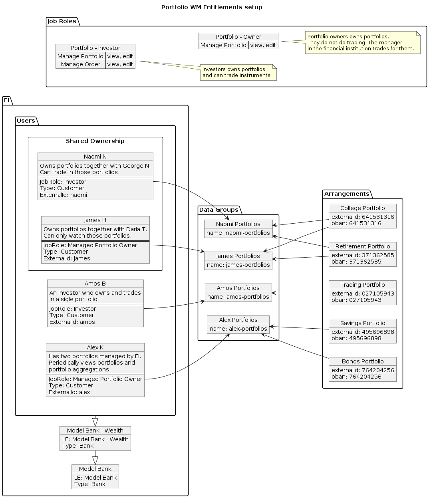

# [Drive Wealth Integration] Entitlements

## Table of Contents 
 - [Base Legal Entity Hierarchy](#base-legal-entity-hierarchy)
- [General setup](#general-setup)
-- [Root Legal Entities](#root-legal-entities)
-- [Customers Legal Entities](#customers-legal-entities)
--- [Users Personas](#users-personas)
--- [Users](#users)
--- [Reference Job Roles](#reference-job-roles)
--- [Product Types](#product-types)
- [Use Cases](#use-cases)
-- [Naomi & James Shared Portfolio Ownership](#naomi-&-james-shared-portfolio-ownership)
--- [Users](#users)
--- [Data Groups and Portfolios](#data-groups-and-portfolios)
-- [Alex’s Discretionary Portfolios](#alex’s-discretionary-portfolios)
--- [Users](#users)
--- [Data Group and Portfolios](#data-group-and-portfolios)
-- [Amos’s non-discretionary portfolios](#amos’s-non-discretionary-portfolios)
--- [Users](#users)
--- [Data Group and Portfolios](#data-group-and-portfolios)
-- [Context switching for portfolios](#context-switching-for-portfolios)
--- [Users](#users)
--- [Data Group and Portfolios](#data-group-and-portfolios)
# Base Legal Entity Hierarchy

**Bootstrap/Stream Implementation Notes**

- Legal Entities of type “Bank” will have users associated with the Employee realm, all other legal entities will have users associated with the Customer realm.

**Reference Job Roles**

All Reference Job Roles are defined at the FI Head Office level.

**Bank Job Roles**
- Bank Admin
- Bank Employee
**Wealth Job Roles**
- Wealth User
- Portfolio Owner
- Portfolio Investor

**Bank Level Users**

# General setup

> Old Diagram 
>
> > This below diagram has been replaced by more detailed diagrams inside each Use Case
> 

## Root Legal Entities

Bank’s legal entity will follow the same Hierarchy used by `backbase-bootstrap-task`  using the same `Financial Institution Branch` under the `Financial Institution Head Office`

## Customers Legal Entities

These customers will be able to manage and view their own portfolios.

### Users Personas

### Users

| Username | Full Name | Email                                                                          |
| -------- | --------- | ------------------------------------------------------------------------------ |
| naomi    | Naomi N   | [<ul>naomin@modelbank.backbase.com</ul>](mailto:naomin@modelbank.backbase.com) |
| james    | James H   | [<ul>jamesh@modelbank.backbase.com</ul>](mailto:jamesh@modelbank.backbase.com) |
| alex     | Alex K    | [<ul>alexk@modelbank.backbase.com</ul>](mailto:alexk@modelbank.backbase.com)   |
| amos     | Amos B    | [<ul>amosb@modelbank.backbase.com</ul>](mailto:amosb@modelbank.backbase.com)   |
| taylor   | Taylor P  | [taylorp@modelbank.backbase.com](mailto:taylorp@modelbank.backbase.com)        |

### Reference Job Roles

| Job Role             | Business Function                         | Privilege                                                          | Description                                              |
| -------------------- | ----------------------------------------- | ------------------------------------------------------------------ | -------------------------------------------------------- |
| Portfolio - Investor | `Manage Portfolio`                        | `view` `edit`                                                      | The investor owns portfolios and can trade instruments.  |
| `Manage Order`       | `create` `view` `edit`                    |                                                                    |                                                          |
| Portfolio - Owner    | `Manage Portfolio`                        | `view` `edit`                                                      | Managed portfolio owner owns portfolios but can’t trade. |
| `Manage Order`       | `view`                                    | Only view the orders                                               |                                                          |
| Wealth User          | Manage Statements                         | `view`                                                             | View Account statements                                  |
| A2A Transfer         | `view` `edit` `cancel` `delete` `create`  | Create internal transfers between own accounts `INTERNAL_TRANSFER` |                                                          |
| Product Summary      | `view` `edit`                             | View Account selector in payment journey                           |                                                          |
| Manage Messages      | `view` `edit` `create` `delete`           | Create, view, and delete messages                                  |                                                          |
| Manage Notifications | `view` `edit` `create` `delete`           | Create, view, and delete notification                              |                                                          |

### Product Types

The Portfolio service works with investment accounts. Registering the product type for the investment account product is necessary.

| External Kind Name     | External Product Kind ID |
| ---------------------- | ------------------------ |
| `investment-``account` | `kind8`                  |

# Use Cases

## Naomi & James Shared Portfolio Ownership

Two persons co-own investment portfolios. One person can trade instruments. Another only has a right to view portfolios.

### Users

| User  | Job Role                              |
| ----- | ------------------------------------- |
| naomi | - Portfolio - Investor
- Wealth User
 |
| james | - Portfolio - Owner
- Wealth User
    |

### Data Groups and Portfolios

| Type                                       | Details   |
| ------------------------------------------ | --------- |
| DG: **Naomi Portfolios, James Portfolios** |           |
| College Portfolio                          | 641531316 |
| Retirement Portfolio                       | 371362585 |

## Alex’s Discretionary Portfolios

The person who owns a few portfolios but can’t trade. A financial institution manager advises on a portfolio setup and makes all the trading. The portfolio owner only monitors their portfolios.

### Users

| User | Job Role                           |
| ---- | ---------------------------------- |
| Alex | - Portfolio - Owner
- Wealth User
 |

### Data Group and Portfolios

| Type                    | Details   |
| ----------------------- | --------- |
| DG: **Alex Portfolios** |           |
| Investment Portfolio    | 495696898 |
| Investment Portfolio    | 764204256 |

## Amos’s non-discretionary portfolios

The person actively trades investment instruments and manages portfolios.

### Users

| User | Job Role                              |
| ---- | ------------------------------------- |
| amos | - Portfolio - Investor
- Wealth User
 |

### Data Group and Portfolios

| Type                    | Details   |
| ----------------------- | --------- |
| DG: **Amos Portfolios** |           |
| Investment Portfolio    | 027105943 |

## Context switching for portfolios

Taylor P is a beginner investor who wants to try some aggressive investment strategies. She understands the risk, so she's allocating only a small amount of funds for the experimentation.

Before investing, Taylor established a solid backup. She has a retirement portfolio, which is managed for her by the Bank.

She wants to keep all investment activities separate from the backup portfolios, so she's using a dedicated context to work with the investment portfolio.

Her retirement portfolio is linked to her master service agreement. The "Investment" custom service agreement holds her "Experimental" portfolio. 

When logging in, Taylor decides whether she would interact with her experimental portfolio or review her retirement funds.

### Users

| User       | Service Agreement                  | Job Role                              |
| ---------- | ---------------------------------- | ------------------------------------- |
| taylor     | MSA                                | - Portfolio - Investor
- Wealth User
 |
| Investment | - Portfolio - Owner
- Wealth User
 |                                       |

### Data Group and Portfolios

| Service Agreement      | Type                                 | Details |
| ---------------------- | ------------------------------------ | ------- |
| MSA                    | DG: **Taylor Portfolios**            |         |
| Retirement Portfolio   | 379601127                            |         |
| Investment             | DG: **Taylor Investment Portfolios** |         |
| Experimental Portfolio | 732194030                            |         |
