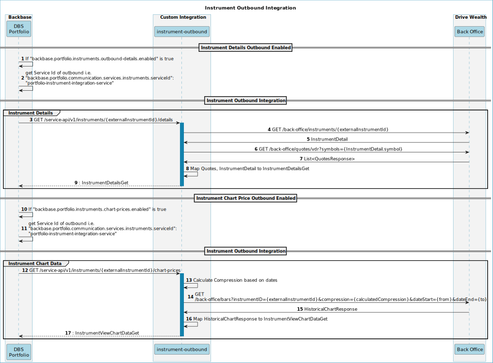

# Instrument Integration Outbound API Mapping

## Table of Contents 
 -- [Sequence Diagram
](#sequence-diagram
)
-- [

Instrument Details](#

instrument-details)
---- [R&D Key statistics document

 [https://docs.google.com/spreadsheets/d/1FGF1RW4_D2DyqXKZtdS35SPIfyHhKBolwJUKQ_OWC5A/edit#gid=0](https://docs.google.com/spreadsheets/d/1FGF1RW4_D2DyqXKZtdS35SPIfyHhKBolwJUKQ_OWC5A/edit#gid=0) 
](#r&d-key-statistics-document

-[https://docs.google.com/spreadsheets/d/1fgf1rw4_d2dyqxkztds35spifyhhkbolwjukq_owc5a/edit#gid=0](https://docs.google.com/spreadsheets/d/1fgf1rw4_d2dyqxkztds35spifyhhkbolwjukq_owc5a/edit#gid=0)-
)
---- [API Mapping](#api-mapping)
-- [Instrument Chart Data](#instrument-chart-data)
---- [BB Period and DW compression mapping](#bb-period-and-dw-compression-mapping)
---- [
API Mapping
](#
api-mapping
)
## Sequence Diagram

## 

Instrument Details

#### R&D Key statistics document

 [https://docs.google.com/spreadsheets/d/1FGF1RW4_D2DyqXKZtdS35SPIfyHhKBolwJUKQ_OWC5A/edit#gid=0](https://docs.google.com/spreadsheets/d/1FGF1RW4_D2DyqXKZtdS35SPIfyHhKBolwJUKQ_OWC5A/edit#gid=0) 

#### API Mapping

| **BB Field**
[https://developer.backbase.com/apis/specs/portfolio/portfolio-instrument-integration-outbound-api/1.0.1/operations/InstrumentChartsClient/getInstrumentChartData/](https://developer.backbase.com/apis/specs/portfolio/portfolio-instrument-integration-outbound-api/1.0.1/operations/InstrumentChartsClient/getInstrumentChartData/)  | **DW Field**
 quotes : [https://developer.drivewealth.com/reference/get_quotes](https://developer.drivewealth.com/reference/get_quotes) 
instrumentDetail : [https://developer.drivewealth.com/reference/get_instruments-instrumentid](https://developer.drivewealth.com/reference/get_instruments-instrumentid)  | **Description**                         |
| ---------------------------------------------------------------------------------------------------------------------------------------------------------------------------------------------------------------------------------------------------------------------------------------------------------------------------------------------------- | ----------------------------------------------------------------------------------------------------------------------------------------------------------------------------------------------------------------------------------------------------------------------------------------------------------------- | --------------------------------------- |
| priceData.price.amount                                                                                                                                                                                                                                                                                                                               | quotes.lastTrade                                                                                                                                                                                                                                                                                                  |                                         |
| priceData.price.currencyCode                                                                                                                                                                                                                                                                                                                         | USD                                                                                                                                                                                                                                                                                                               | constant                                |
| priceData.pricePerformance                                                                                                                                                                                                                                                                                                                           | quotes.change                                                                                                                                                                                                                                                                                                     |                                         |
| priceData.pricePerformanceAbs                                                                                                                                                                                                                                                                                                                        | When market open 

(quotes.change /quoes.priorClose) * 100

When Market Close
(quotes.close - quotes.priorClose /quoes.close) * 100                                                                                                                                                                               |                                         |
| priceData.askPrice                                                                                                                                                                                                                                                                                                                                   | quotes.ask                                                                                                                                                                                                                                                                                                        |                                         |
| priceData.bidPrice                                                                                                                                                                                                                                                                                                                                   | quotes.bid                                                                                                                                                                                                                                                                                                        |                                         |
| priceData.askVolume                                                                                                                                                                                                                                                                                                                                  | instrumentDetail.fundamentalDataModel.askPrice                                                                                                                                                                                                                                                                    |                                         |
| priceData.bidVolume                                                                                                                                                                                                                                                                                                                                  | instrumentDetail.fundamentalDataModel.bidPrice                                                                                                                                                                                                                                                                    |                                         |
| priceData.totalVolume                                                                                                                                                                                                                                                                                                                                | instrumentDetail.fundamentalDataModel.cumulativeVolume                                                                                                                                                                                                                                                            |                                         |
| priceData.closePrice                                                                                                                                                                                                                                                                                                                                 | quotes.close or quotes.PriorClose                                                                                                                                                                                                                                                                                 | Which ever is not zero from one of them |
| priceData.openPrice                                                                                                                                                                                                                                                                                                                                  | instrumentDetail.fundamentalDataModel.openPrice                                                                                                                                                                                                                                                                   |                                         |
| priceData.lowPrice                                                                                                                                                                                                                                                                                                                                   | instrumentDetail.fundamentalDataModel.lowPrice                                                                                                                                                                                                                                                                    |                                         |
| priceData.highPrice                                                                                                                                                                                                                                                                                                                                  | instrumentDetail.fundamentalDataModel.highPrice                                                                                                                                                                                                                                                                   |                                         |
| priceData.dayRange.min                                                                                                                                                                                                                                                                                                                               | instrumentDetail.fundamentalDataModel.lowPrice                                                                                                                                                                                                                                                                    |                                         |
| priceData.dayRange.max                                                                                                                                                                                                                                                                                                                               | instrumentDetail.fundamentalDataModel.highPrice                                                                                                                                                                                                                                                                   |                                         |
| priceData.week52Range.min                                                                                                                                                                                                                                                                                                                            | instrumentDetail.fundamentalDataModel.fiftyTwoWeekLowPrice                                                                                                                                                                                                                                                        |                                         |
| priceData.week52Range.max                                                                                                                                                                                                                                                                                                                            | instrumentDetail.fundamentalDataModel.fiftyTwoWeekHighPrice                                                                                                                                                                                                                                                       |                                         |
| keyStatistics.fundStatus                                                                                                                                                                                                                                                                                                                             | instrumentDetail.status                                                                                                                                                                                                                                                                                           |                                         |
| keyStatistics.totalAssets                                                                                                                                                                                                                                                                                                                            | instrumentDetail.fundamentalDataModel.marketCap                                                                                                                                                                                                                                                                   |                                         |
| keyStatistics.portfolioAssetsAllocation                                                                                                                                                                                                                                                                                                              | instrumentDetail.type                                                                                                                                                                                                                                                                                             |                                         |
| keyStatistics.priceToEarningsRatio                                                                                                                                                                                                                                                                                                                   | instrumentDetail.fundamentalDataModel.peRatio                                                                                                                                                                                                                                                                     | scale 2 for decimal                     |
| keyStatistics.sharesOutstanding                                                                                                                                                                                                                                                                                                                      | instrumentDetail.fundamentalDataModel.sharesOutstanding                                                                                                                                                                                                                                                           |                                         |
| keyStatistics.priceToBookRatio                                                                                                                                                                                                                                                                                                                       | instrumentDetail.fundamentalDataModel.pbRatio                                                                                                                                                                                                                                                                     | scale 2 for decimal                     |
| keyStatistics.earningsPerShare                                                                                                                                                                                                                                                                                                                       | instrumentDetail.fundamentalDataModel.earningsPerShare                                                                                                                                                                                                                                                            | scale 2 for decimal                     |
| keyStatistics.dividendYield                                                                                                                                                                                                                                                                                                                          | instrumentDetail.fundamentalDataModel.dividendYield                                                                                                                                                                                                                                                               | scale 2 for decimal                     |

## Instrument Chart Data

#### BB Period and DW compression mapping

| **BB Chart period** | **DriveWealth Compression** | **description** |
| ------------------- | --------------------------- | --------------- |
| 1D                  | 4                           | 5 minutes       |
| 1W                  | 8                           | 30 minutes      |
| 3M                  | 0                           | Daily           |
| 1Y                  | 0                           | Daily           |
| All                 | 10                          | Weekly          |

> DriveWealth Compression table
>
> source → [https://developer.drivewealth.com/reference/get-charts](https://developer.drivewealth.com/reference/get-charts) 
> | **Compression** | **Description** |
> | --------------- | --------------- |
> | 0               | Daily           |
> | 1               | 1 minute        |
> | 4               | 5 minutes       |
> | 8               | 30 minutes      |
> | 9               | 1 hour          |
> | 10              | Weekly          |

#### 
API Mapping

| **BB Field**
[https://developer.backbase.com/apis/specs/portfolio/portfolio-instrument-integration-outbound-api/1.0.1/operations/InstrumentChartsClient/getInstrumentChartData/](https://developer.backbase.com/apis/specs/portfolio/portfolio-instrument-integration-outbound-api/1.0.1/operations/InstrumentChartsClient/getInstrumentChartData/)  | **DW Field**
[https://developer.drivewealth.com/reference/get-charts](https://developer.drivewealth.com/reference/get-charts)                                                                                                      | **Description**                                                                          |
| ---------------------------------------------------------------------------------------------------------------------------------------------------------------------------------------------------------------------------------------------------------------------------------------------------------------------------------------------------- | ---------------------------------------------------------------------------------------------------------------------------------------------------------------------------------------------------------------------------------- | ---------------------------------------------------------------------------------------- |
| date                                                                                                                                                                                                                                                                                                                                                 | For **Date** : data.split(“//|”)[0]                                                                                                                                                                                                | Data is returned from DW in this from separated by pipe: Data,Open,High,Low,Close,Volume |
| price                                                                                                                                                                                                                                                                                                                                                | For **Open** : Data Index is 1 i.e. data.split(“//|”)[1]
For **HIGH** : Data index is 2 i.e. data.split(“//|”)[2]
For **Low**: Data index is 3 i.e. data.split(“//|”)[3]
FOr **Close** : Data index is 4 i.e. data.split(“//|”)[4] | There are 4 price types that we need for every time period                               |
| currency                                                                                                                                                                                                                                                                                                                                             | USD                                                                                                                                                                                                                                | Constant                                                                                 |
| priceType                                                                                                                                                                                                                                                                                                                                            | **OPEN**, **LOW**, **HIGH**, **CLOSE**                                                                                                                                                                                             | 

                                                                                       |

 
