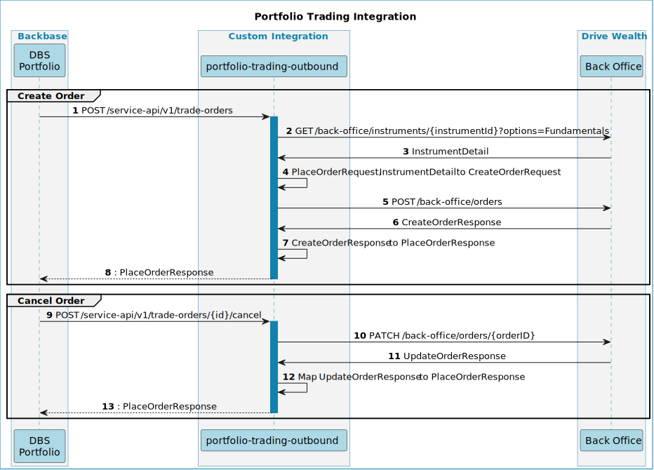

# Portfolio Trading Outbound API Mapping

## Table of Contents 
 - [Sequence Diagram](#sequence-diagram)
- [Place Order ](#place-order-)
-- [API in Use](#api-in-use)
-- [Request Mapping](#request-mapping)
-- [Response Mapping](#response-mapping)
- [Cancel Order](#cancel-order)
-- [Request Mapping](#request-mapping)
-- [Response Mapping](#response-mapping)
- [Calculate Order Commissions](#calculate-order-commissions)
- [Place Price Alert](#place-price-alert)
# Sequence Diagram

# Place Order 

## API in Use

**BB API**: `POST /service-api/v1/trade-orders`
**DW API**: [https://developer.drivewealth.com/reference/post_orders](https://developer.drivewealth.com/reference/post_orders)  [https://developer.drivewealth.com/reference/get_instruments-instrumentid](https://developer.drivewealth.com/reference/get_instruments-instrumentid) 

## Request Mapping

| **DW Field**
[https://developer.drivewealth.com/reference/post_orders](https://developer.drivewealth.com/reference/post_orders)  | **BB Field**
[https://developer.backbase.com/apis/specs/portfolio/portfolio-trading-integration-outbound-api/1.0.7/operations/TradeOrder/placeOrder/](https://developer.backbase.com/apis/specs/portfolio/portfolio-trading-integration-outbound-api/1.0.7/operations/TradeOrder/placeOrder/)  | **Description**                                                                                                                                     | **Notes**                                                                                  |
| -------------------------------------------------------------------------------------------------------------------------------- | ---------------------------------------------------------------------------------------------------------------------------------------------------------------------------------------------------------------------------------------------------------------------------------------------- | --------------------------------------------------------------------------------------------------------------------------------------------------- | ------------------------------------------------------------------------------------------ |
| symbol                                                                                                                           | instrumentId                                                                                                                                                                                                                                                                                   | StringExternal identifier of the traded instrument                                                                                                  | There will be separate call to DW get InstrumentById to get symbol of requested instrument |
| accountNo                                                                                                                        | portfolioId                                                                                                                                                                                                                                                                                    | StringExternal identifier of the portfolio                                                                                                          |                                                                                            |
| orderType                                                                                                                        | orderType                                                                                                                                                                                                                                                                                      | [**order-type**](https://developer.backbase.com/apis/specs/portfolio/portfolio-trading-integration-outbound-api/1.0.7/models/order-type/)           | `MARKET_ORDER` from BB will be `MARKET` in DW`LIMIT_ORDER` from BB will be `LIMIT` in DW   |
| side                                                                                                                             | direction                                                                                                                                                                                                                                                                                      | [**trade-direction**](https://developer.backbase.com/apis/specs/portfolio/portfolio-trading-integration-outbound-api/1.0.7/models/trade-direction/) |                                                                                            |
| quantity                                                                                                                         | quantity                                                                                                                                                                                                                                                                                       | BigDecimalNumber of shares to sell/buy                                                                                                              |                                                                                            |
| amountCash                                                                                                                       | amount                                                                                                                                                                                                                                                                                         | [**money**](https://developer.backbase.com/apis/specs/portfolio/portfolio-trading-integration-outbound-api/1.0.7/models/money/)                     |                                                                                            |
| price                                                                                                                            | limitPrice                                                                                                                                                                                                                                                                                     | [**money**](https://developer.backbase.com/apis/specs/portfolio/portfolio-trading-integration-outbound-api/1.0.7/models/money/)                     |                                                                                            |
| expiration                                                                                                                       | expirationDate                                                                                                                                                                                                                                                                                 | dateThe date until limit order must be executed. Only for Limit Order.                                                                              |                                                                                            |
|                                                                                                                                  | accountId                                                                                                                                                                                                                                                                                      | StringExternal identifier of the account                                                                                                            |                                                                                            |
|                                                                                                                                  | accountIBAN                                                                                                                                                                                                                                                                                    | StringThe IBAN of the investment account                                                                                                            |                                                                                            |

## Response Mapping

| **BB Field**
[https://developer.backbase.com/apis/specs/portfolio/portfolio-trading-integration-outbound-api/1.0.7/operations/TradeOrder/cancelOrder/](https://developer.backbase.com/apis/specs/portfolio/portfolio-trading-integration-outbound-api/1.0.7/operations/TradeOrder/cancelOrder/)   | **DW Field**
[https://developer.drivewealth.com/reference/patch_orders-orderid](https://developer.drivewealth.com/reference/patch_orders-orderid)  | **Description**                     |
| ------------------------------------------------------------------------------------------------------------------------------------------------------------------------------------------------------------------------------------------------------------------------------------------------- | -------------------------------------------------------------------------------------------------------------------------------------------------- | ----------------------------------- |
| orderId                                                                                                                                                                                                                                                                                           | id                                                                                                                                                 | StringExternal identifier of order  |
| status                                                                                                                                                                                                                                                                                            | PENDING                                                                                                                                            | Defult status for successful orders |

# Cancel Order

## Request Mapping

| **BB Field**
[https://developer.backbase.com/apis/specs/portfolio/portfolio-trading-integration-outbound-api/1.0.7/operations/TradeOrder/cancelOrder/](https://developer.backbase.com/apis/specs/portfolio/portfolio-trading-integration-outbound-api/1.0.7/operations/TradeOrder/cancelOrder/)   | **DW Field**
[https://developer.drivewealth.com/reference/patch_orders-orderid](https://developer.drivewealth.com/reference/patch_orders-orderid)  | **Description**                    |
| ------------------------------------------------------------------------------------------------------------------------------------------------------------------------------------------------------------------------------------------------------------------------------------------------- | -------------------------------------------------------------------------------------------------------------------------------------------------- | ---------------------------------- |
| id                                                                                                                                                                                                                                                                                                | orderID                                                                                                                                            | StringExternal identifier of order |

## Response Mapping

| **BB Field**
[https://developer.backbase.com/apis/specs/portfolio/portfolio-trading-integration-outbound-api/1.0.7/operations/TradeOrder/cancelOrder/](https://developer.backbase.com/apis/specs/portfolio/portfolio-trading-integration-outbound-api/1.0.7/operations/TradeOrder/cancelOrder/)   | **DW Field**
[https://developer.drivewealth.com/reference/patch_orders-orderid](https://developer.drivewealth.com/reference/patch_orders-orderid)  | **Description**                     |
| ------------------------------------------------------------------------------------------------------------------------------------------------------------------------------------------------------------------------------------------------------------------------------------------------- | -------------------------------------------------------------------------------------------------------------------------------------------------- | ----------------------------------- |
| orderId                                                                                                                                                                                                                                                                                           | id                                                                                                                                                 | StringExternal identifier of order  |
| status                                                                                                                                                                                                                                                                                            | PENDING                                                                                                                                            | Defult status for successful orders |

# Calculate Order Commissions

Not supported

# Place Price Alert

Not Supported
