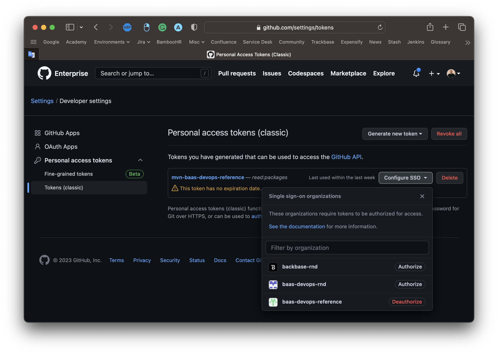

# Portfolio Trading Integration Service

## Repository Overview

- This project is a development of a small set of [Backbase Service SDK](https://community.backbase.com/documentation/ServiceSDK/latest/index) (**Spring Boot** and **Cloud**) based Microservices projects that implement cloud-native intuitive, Microservices design patterns, and coding best practices.
- The project follows [**CloudNative**](https://www.cncf.io/) recommendations and the [**twelve-factor app**](https://12factor.net/) methodology for building *software-as-a-service apps* to show how μServices should be developed and deployed.
- This project uses technologies broadly used in Backbase. Like Docker, Kubernetes, Java SE 17, Spring Boot, Spring Cloud
- 'portfolio-trading-integration-service' has been generated using `core-service-archetype` - [Community guide](https://community.backbase.com/documentation/ServiceSDK/latest/create_a_core_service)
- This service create and update Trading order in DriveWealth.
- The service is implementation of Portfolio Trading outbound specs - https://repo.backbase.com/ui/native/specs/portfolio/
- Refer to [workflow guide](../../../docs/tree/master/backend) for Backend CI Workflow documentation


## Sequence diagram


---
## Repository Description
### Project Structure
The project structure for each custom integration service follows the pattern as described below :

```
.
├── .github                       # All GitHub Actions files
│   ├── ISSUE_TEMPLATE            # Templates for 'major','minor','patch' releases
│   └── workflows                 # GitHub Actions workflows for CI
├── src                           # Source and Unit Test files
    ├── main                      # Application container projects
    │   ├── java/com/backbase/productled
    │   │   ├── api               # Controller classes
    │   │   │   └── ...
    │   │   ├── config            # Configuration classes
    │   │   │   └── ...
    │   │   ├── mapper            # Model classes
    │   │   │   └── ...
    │   │   └── service           # Service classes
    │   │       └── ...
    │   └── resources             # All resource files except core classes
    │       └── ...
    └── test                      # JUnit test file
        └── ...
```

To view individual classes for this repository, select relevant branch from the GitHub UI and then press ‘.'
This will open the GitHub Web Editor.Alternatively, you can also access the Web Editor by changing .com to .dev in the URL.

Expand each file in the Web Editor for explanation and purpose.

---
## Bass Topstack configuration

https://github.com/baas-devops-reference/topstack/tree/main/values/applications/portfolio-trading-integration-service

## Repository Configurations

### Runtime Topstack configuration

```yaml
selector:
  - wealth-management-universal #This will include this application from topstack to runtime

applications:
  portfolio-trading-integration-service:
    values:
      fullnameOverride: "portfolio-trading-integration-service"
      image:
        tag: 0.1.0
```

#### DriveWealth config (if applicable)
The following properties **must** be set as they have no default:

Property | Description
--- | ---
**drive-wealth.baseUrl** | Base URL of DriveWealth API (i.e. `https://bo-api.drivewealth.io`)
**drive-wealth.dwClientAppKey** | DW Client key
**drive-wealth.clientID** | Client Id
**drive-wealth.clientSecret** | Client secret

---
## Getting Started
### Local setup

To be able to build locally, please add this to your local Maven settings in `~/.m2/settings.xml`:
```xml
<repository>
    <id>github-baas-ref</id>
    <url>https://maven.pkg.github.com/baas-devops-reference/*</url>
    <snapshots>
        <enabled>true</enabled>
    </snapshots>
</repository>
```

And generate a GitHub token and add it here.

### How to generate a GitHub token and add that to Maven configuration

- Visit the following page (logged in with your EMU user - username ends with `_backbase`) https://github.com/settings/tokens
- Click on `Generate new token`
- You can name it `mvn-baas-devops-reference` (or whatever makes sense for you)
  — Provide the following permission: `read:packages` (no other permission is needed)
- Authorize the token by clicking on the `Configure SSO` button next to the created token name and `Authorize` the `baas-devops-reference` organization



Add the generated GitHub token to the Maven settings in `~/.m2/settings.xml`:

```xml
        <server>
            <id>github-baas-ref</id>
            <username>[USERNAME]_backbase</username>
            <password>[GITHUB TOKEN]</password>
        </server>
```

- [ ] Step 1: Ensure to check the prerequisites for [local developer environment](https://community.backbase.com/documentation/ServiceSDK/latest/create_developer_environment)
- [ ] Step 2: Create `src/main/resources/application-local.yaml` file, then add and modify:
```yaml
  drive-wealth:
      baseUrl: https://bo-api.drivewealth.io
      dwClientAppKey: <>
      clientID: <>
      clientSecret: <>
      userId: <>
```
- [ ] Step 3: Run command => `mvn spring-boot:run -Dspring.profiles.active=local`
- [ ] Step 4: To run the service from the built binaries, use => `java -jar target/portfolio-trading-integration-service-0.1.0-SNAPSHOT.jar -Dspring.profiles.active=local`
---
## Contributions
Please create a branch and a PR with your contributions. Commit messages should follow [semantic commit messages](https://seesparkbox.com/foundry/semantic_commit_messages)
