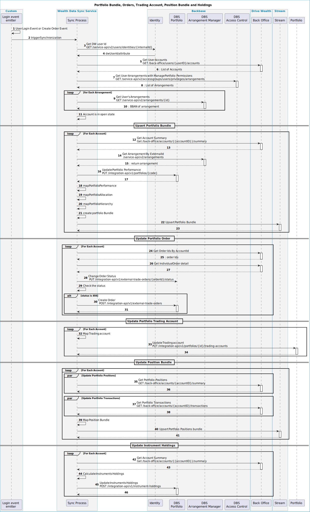

# Repository Overview

implement cloud-native intuitive, Microservices design patterns, and coding best practices.

- The project follows [**CloudNative**](https://www.cncf.io/) recommendations and the [**twelve-factor app
  **](https://12factor.net/) methodology for building *software-as-a-service apps* to show how μServices should be
  developed and deployed.
- This project uses technologies broadly used in Backbase. Like Docker, Kubernetes, Java SE 17, Spring Boot, Spring
  Cloud
- `wealth-data-sync-service` has been generated
  using `core-service-archetype` - [Community guide](https://community.backbase.com/documentation/ServiceSDK/latest/create_a_core_service)
- This service mean to synchronize users portfolios data upon user lgoin events .
- Refer to [workflow guide](https://github.com/baas-devops-reference/docs/tree/master/backend) for Backend CI Workflow
  documentation

## Sequence diagram



## Repository Description

### Project Structure

The project structure for each custom integration service follows the pattern as described below :

```
.
├── .github                       # All GitHub Actions files
│   ├── ISSUE_TEMPLATE            # Templates for 'major','minor','patch' releases
│   ├── actions                   # Github reusable actions for CI
│   └── workflows                 # GitHub Actions workflows for CI
├── src                           # Source and Unit Test files
    ├── main                      # Application container projects
    │   ├── java/com/backbase/productled
    │   │   ├── api               # Controller classes
    │   │   │   └── ...
    │   │   ├── config            # Configuration classes
    │   │   │   └── ...
    │   │   ├── mapper            # Mapper classes
    │   │   │   └── ...
    │   │   └── service           # Service classes
    │   │       └── ...
    │   └── resources             # All resource files except core classes
    │       └── ...
    └── test                      # JUnit test file
        └── ...
```

To view individual classes for this repository, select relevant branch from the GitHub UI and then press ‘.'
This will open the GitHub Web Editor.Alternatively, you can also access the Web Editor by changing .com to .dev in the
URL.

Expand each file in the Web Editor for explanation and purpose.

---

## Bass Topstack configuration

[wealth-data-sync-service](https://github.com/backbase-common/topstack/tree/main/values/applications/wealth-data-sync-service)

---

## Repository Configurations

### Runtime Topstack configuration

```yaml
selector:
  - wealth-management-universal #This will include this application from topstack to runtime
applications:
  wealth-data-sync-service:
    values:
      fullnameOverride: "wealth-data-sync-service"
      image:
        repository: wealth-data-sync-service
        tag: <tag>
```

#### drive Wealth config

The following properties **can** be set as they have no default:

| Property                        | Description                                                  |
|---------------------------------|--------------------------------------------------------------|
| **drive-wealth.baseUrl**        | Base URL of DW apiAPI (i.e. `https://bo-api.drivewealth.io`) |
| **drive-wealth.dwClientAppKey** | Client app key                                               |
| **drive-wealth.clientID**       | Client id                                                    |
| **drive-wealth.clientSecret**   | Client secret                                                |

---

## Getting Started

### BaaS setup

- [ ] Step 1: Modify https://github.com/baas-devops-reference/azure-reference-self-service/blob/main/self-service.tfvars
  by adding to `ecr` list name of new repository: `wealth-data-sync-service'
- [ ] Step 2: Checkout the following
  repository: https://github.com/baas-devops-reference/reference-applications-live/blob/main/azure/runtimes/wealth-dev/apps/values.yaml
  apply your deployment configurations example.
- [ ] Step 3: Modify DSC configuration for...
- [ ] Step 4: Run the pre-commit to validate the
  configurations => ` pre-commit run --all-files --show-diff-on-failure --color=always`
- [ ] Step 5: Commit and Push your changes; wait for the template rendering and lint jobs to complete
- [ ] Step 6: Merge into `main` to trigger deployment.

### Local setup

To be able to build locally, please add this to your local Maven settings in `~/.m2/settings.xml`:
```xml
<repository>
    <id>github-baas-ref</id>
    <url>https://maven.pkg.github.com/baas-devops-reference/*</url>
    <snapshots>
        <enabled>true</enabled>
    </snapshots>
</repository>
```

And generate a GitHub token and add it here.

### How to generate a GitHub token and add that to Maven configuration

- Visit the following page (logged in with your EMU user - username ends with `_backbase`) https://github.com/settings/tokens
- Click on `Generate new token`
- You can name it `mvn-baas-devops-reference` (or whatever makes sense for you)
  — Provide the following permission: `read:packages` (no other permission is needed)
- Authorize the token by clicking on the `Configure SSO` button next to the created token name and `Authorize` the `baas-devops-reference` organization


Add the generated GitHub token to the Maven settings in `~/.m2/settings.xml`:

```xml
        <server>
            <id>github-baas-ref</id>
            <username>[USERNAME]_backbase</username>
            <password>[GITHUB TOKEN]</password>
        </server>
```

- [ ] Step 1: Ensure to check the prerequisites
  for [local developer environment](https://community.backbase.com/documentation/ServiceSDK/latest/create_developer_environment)
- [ ] Step 2: Create `src/main/resources/application-local.yaml` file, then add and modify:

```yaml
drive-wealth.baseUrl: https://bo-api.drivewealth.io
drive-wealth.dwClientAppKey: <>
drive-wealth.clientID: <>
drive-wealth.clientSecret: <>

cloud.aws.sqs.listener.auto-startup: <>
cloud.aws.region.static: <>
cloud.aws.credentials.access-key: <>
cloud.aws.credentials.secret-key: <>
cloud.aws.end-point.uri: <>
```

- [ ] Step 3: Run command => `mvn spring-boot:run -Dspring.profiles.active=local`
- [ ] Step 4: To run the service from the built binaries,
  use => `java -jar target/wealth-data-sync-service-1.0.0-SNAPSHOT.jar -Dspring.profiles.active=local`

---

## Contributions

Please create a branch and a PR with your contributions. Commit messages should
follow [semantic commit messages](https://seesparkbox.com/foundry/semantic_commit_messages)
